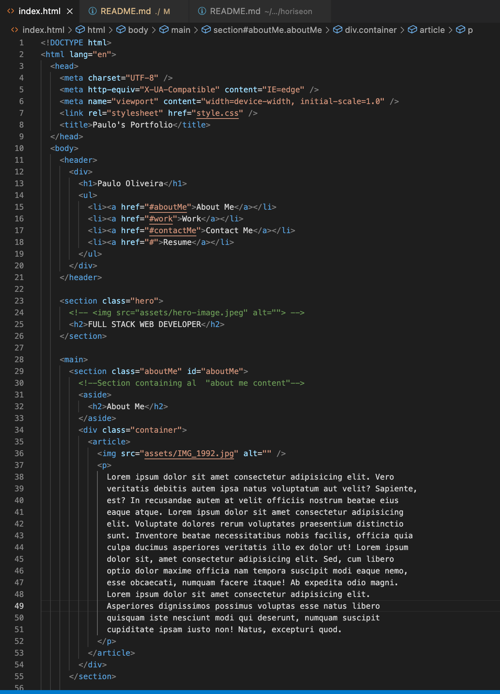
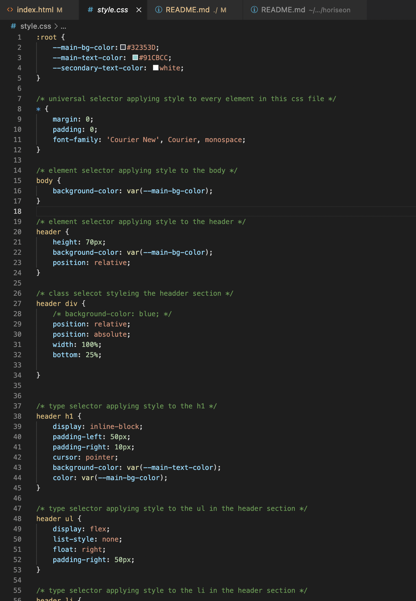
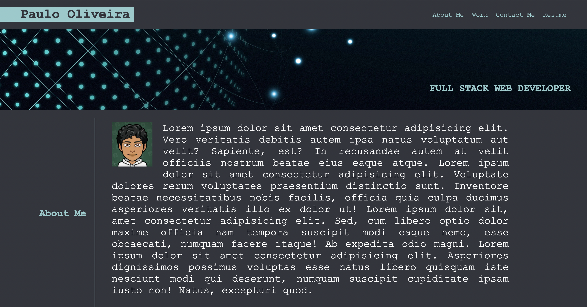

# Portfolio

Using a main landing page as my main business card, I will present myself, provide contact information and showcase my abilities and skills.

Using HTML and CSS this project is focused on creating a portfolio to showcase my skills and talents to potential employers. 

My focus in this project is directed to demonstrate my skills on how I orgazine my HTML in a semantc manner, how I structure my CSS in an effective and non-repeated way, and how I implement responsiveness to best inhence the visitor's experience in whatever device the wesite is being accessed from. Doing so by showcase my deployed websites and applications.

# Links
* Website used to create webpage layout:
![Mockflow] (https://www.mockflow.com/)

![Finished and deployed website project] (https://paulooliveira152012.github.io/portfolio/)

![GitHub-repository] (https://github.com/paulooliveira152012/portfolio)

HTML Screen-shot

CSS Screen-shot

Website Screen-shot

